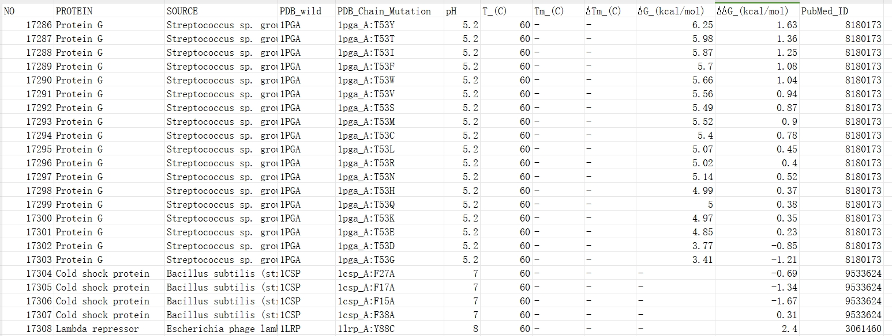
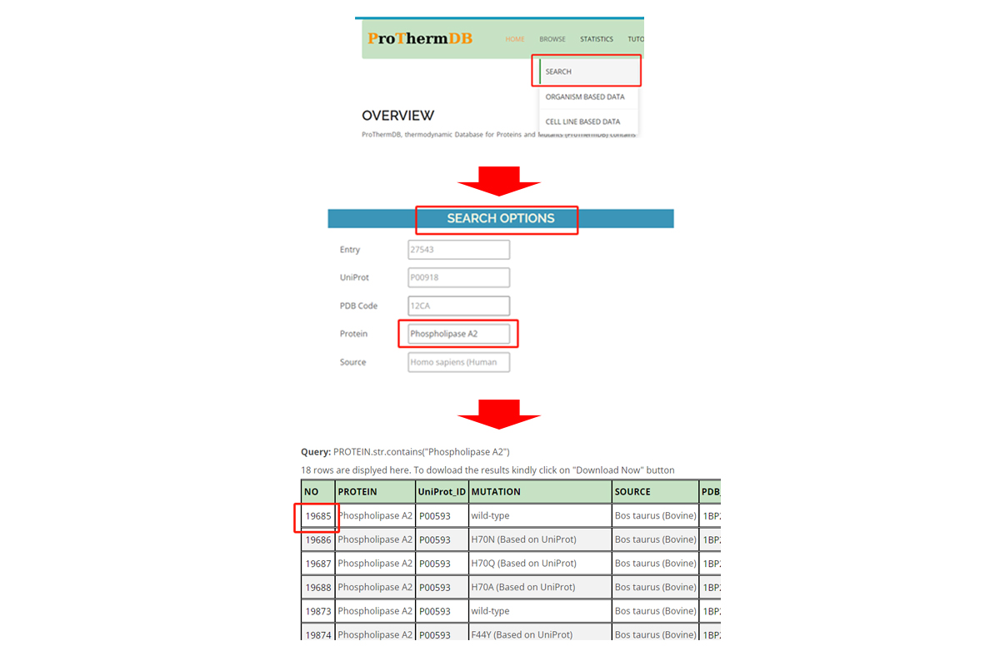
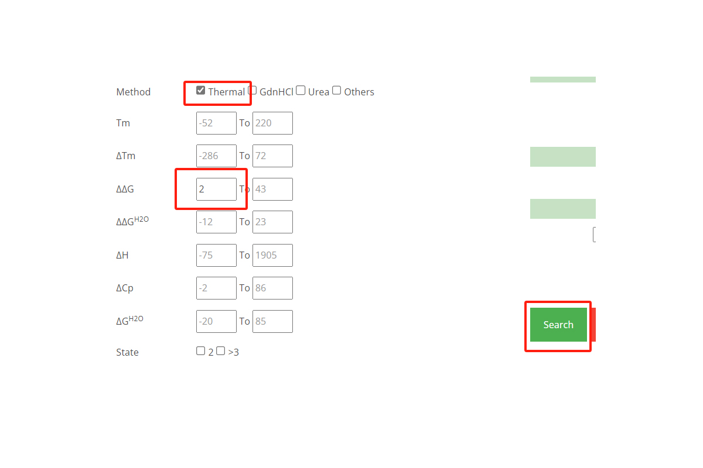
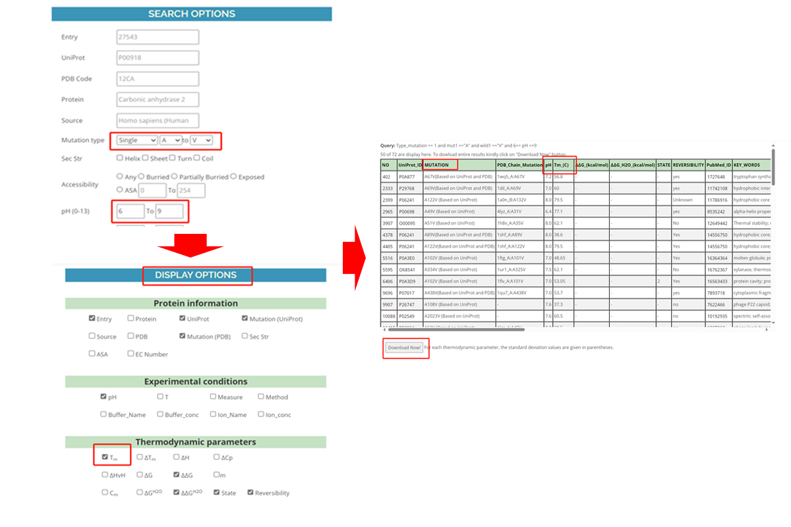

Protein thermodynamics refers to studying behaviour of proteins in different temperatures and other conditions. Thermodynamic research on proteins is related to protein folding, protein function and protein interactions, facilitating to understand protein mechanism . Meanwhile, improvement of proteins based on thermodynamic properties, e.g. protein thermostability, is an important research direction and has been ongoing more than few decades . Different strategies, e.g. directed evolution, semi-rational design, and rational design has been employed and different means, e.g. molecular dynamics simulation, empirical model and machine learning has been utilized for protein thermostability engineering . In those research process, the storing, utilizing, analysing, and sharing of data are crucial for recording key parameters, extracting knowledge, and summarizing patterns. 

For researchers interested in studying protein thermodynamics, collecting valuable data is often the first step. Meanwhile, the FAIR principles are a set of requirements for data publishing platforms, demanding that the data they release should be findable, accessible, interoperable, and reusable. Obtaining data from publishing platforms met the FAIR principles enable researchers to better utilize, share, and reuse data. In this tutorial, some databases met the FAIR principles, how to collect data from them and examples of uses of those data will be introduced.

> <agenda-title></agenda-title>
>
> In this tutorial, we will cover:
>
> 1. TOC
> {:toc}
>
{: .agenda}

# Examples of FAIR protein thermodynamic databases

1. ProthermDB   
ProthermDB is almost the most classic protein thermodynamic databases. Since its release in 1999, it has been continuously updated, with the latest major update occurring in 2020. Currently, it has collected over 32,000 uniquely identified protein thermodynamic data entries. This database mainly includes protein information such as melting temperature, changes in thermostability (ΔΔG), sequences, structures, and literature sources. It can be accessed on [ProthermDB](https://web.iitm.ac.in/bioinfo2/prothermdb/index.html).

2. ThermoMutDB   
ThermoMutDB is also a manually curated protein thermodynamic database. In comparison to ProthermDB, ThermoMutDB has conducted data cleaning and added over 200 protein sources, resulting in approximately 15,000 entries. ThermoMutDB additionally offers a RESTful API, allowing users to programmatically utilize their data. It can be accessed on [ThermoMutDB](https://biosig.lab.uq.edu.au/thermomutdb/).

3. MPTherm   
The MPTherm database focuses on collecting thermodynamic data for membrane proteins. It collected more than 7000 entries and mainly includes information such as protein sequences, structures, membrane topology, experimental conditions, melting temperature, free energy, and literature sources. It can be accessed on [MPTherm](https://www.iitm.ac.in/bioinfo/mptherm/).

4. PROXiMATE   
The PROXiMATE database focuses on collecting thermodynamic data for heterodimeric protein-protein complexes, along with information on their sequences, structures, functions, solvent accessibility, and more. It collected more than 6000 entries and can be accessed on [PROXiMATE](https://www.iitm.ac.in/bioinfo/PROXiMATE/index.html).

# (Meta)data of protein thermodynamic databases

Different protein thermodynamic databases often contain rich metadata and data. Metadata are the data describing and supplementing information for existing data. Metadata aid users in understanding, organizing, managing, and searching data and often include e.g. ID, sources, domains, relationships, and other relevant information.   

For protein thermodynamic databases, the common metadata and data they include mainly are:  

| `Metadata`        |                                                        |
| (Name)            |  (description)                                         |         
| Entry ID          |  the unique identifier of data                         |    
| Protein           |  protein name                                          |   
| PDB Code          |  PDB codes, related to protein crystal structure files |  
| Source            |  species source                                        |  
| Mutation          |  mutation information                                  |  
| pH and T          |  pH and temperature during experimental measurement    |  
| PubMed ID         |  literature source for each data entry                 |  
| `data`            |                                                        |
| (Name)            |  (description)                                         |         
| ΔG and ΔΔG        |  Free energy change (representative for protein thermostability) and the difference in free energy change before and after mutation (representative for changes in protein thermostability)                      |    
| Tm and ΔTm        |  Melting temperature and change in melting temperature before and after mutations                                                                    |    

Table 1: Introduction of common metadata and data that protein thermodynamic databases collected  

  

Figure 1: Example of metadata and data downloaded from ProthermDB  

# Examples for collecting data from Protherm

1. How to retrieve data in ProThermDB for a specific protein?  
     Step 1: Click on SEARCH button and go to search option.  
     Step 2: Input the protein name and search.  
     Step 3: Choose desired rows from search results and have a check.  

  

Figure 2. How to retrieve data in ProThermDB for a specific protein?  

2. How to retrieve the mutations, which have ΔΔG values of more than 2 kcal/mol and are obtained from thermal denaturation experiments?  
     Step 1: Input the minimum and maximum values in ΔΔG field in search option.  
     Step 2: Tick the method “Thermal” and search.  

  

Figure 3. How to retrieve the mutations, which have ΔΔG values of more than 2 kcal/mol and are obtained from thermal denaturation experiments?  

3. How to download the ΔTm data for Alanine to Valine single mutations at pH 6 to 9?  
     Step 1: In search options, select the mutation type “single” and select “A” and “V” in wild-type and mutant residues, respectively.  
     Step 2: Input the minimum and maximum values of pH as 6 and 9.  
     Step 3: In display options, tick the ΔTm.  
     Step 4: Download data from search results.  

  

Figure 4. How to download the ΔTm data for Alanine to Valine single mutations at pH 6 to 9?  

# Examples for using protein thermodynamic data

1. Combining structural Biology Research  
Combining protein thermodynamic parameters with protein structure analysis allows for the study of protein conformations related to thermodynamics, summarizing the influencing factors of protein thermostability and deepening the understanding of the relevant mechanisms .

2. Establishing computational model  
By utilizing experimental parameters, experimental experience, and understanding of the mechanisms, it is possible to establish a computational model for protein thermodynamics. This model can be used to calculate the unknown thermodynamic parameters of new proteins .

3. Further extracting features  
In existing protein thermodynamic data, both the providied protein sequence and structural information hold significant potential for further exploration and analysis. Extracting new features from these data aids in the deeper characterization of protein thermodynamic properties and the data with extracted features are also beneficial for constructing computational models. e.g. [DDGWizard](https://github.com/Mingkai14/DDGWizard.git).

4. Applying with machine learning  
By utilizing existing data and conducting further feature extraction and feature engineering, establishing machine learning models specifically for thermodynamic parameters can enable valuable predictions and contribute to the rational design of proteins .
